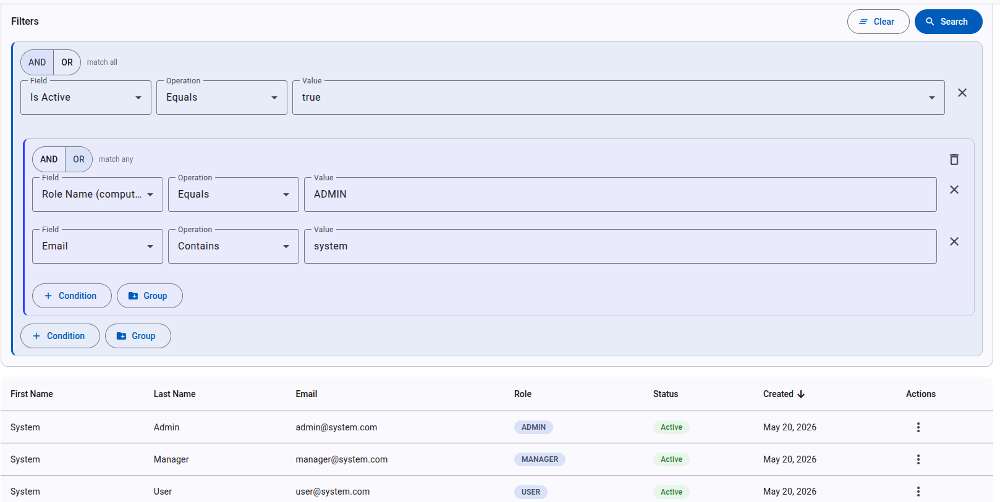
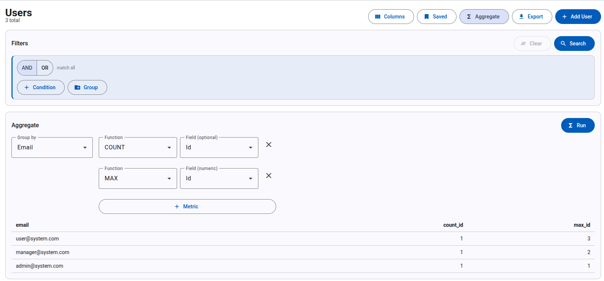
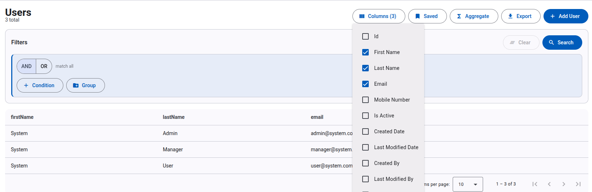
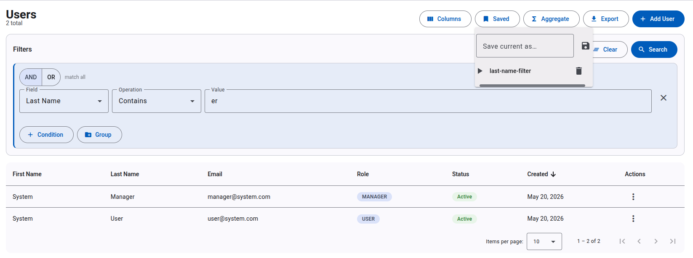

# Generic QueryDSL Builder

> A **metadata-driven JSON query engine** for Spring Boot + Angular — recursive `AND/OR`, projections, group-by aggregations, keyset cursors, saved queries. One reusable engine; every entity gets the full toolset for free.

     

The **engine** is a publishable Java library (`generic-querydsl`). The **demo** is a Spring Boot + Angular reference app (User / Role / Permission management) showcasing every feature against a real database.

🖥️  Companion UI: **[query-builder-ui](https://github.com/aalmahmoud/query-builder-ui)** — Angular 21 standalone, metadata-driven.

---

## ✨ See it in action

> _Screenshots — drop captures into `docs/screenshots/` (filenames below)._

| Recursive AND / OR builder | Group-by aggregations |
|:--:|:--:|
|  |  |
| **Projection (sparse fieldsets)** | **Saved queries** |
|  |  |

📖 **Full guided demo** (UI steps + curl): **[docs/DEMO.md](docs/DEMO.md)**

---

## Why this exists

Every Spring shop hits the same wall: clients want flexible filters, the team writes 30 hand-rolled `findByXAndYOrZ…` methods per entity, then re-rolls them for the next entity. Existing alternatives only get you partway:

| Capability | Spring Data Specifications | RSQL (`rsql-parser`) | `specification-arg-resolver` | **generic-querydsl** |
|---|:-:|:-:|:-:|:-:|
| Add an entity → get filtering | ❌ manual | ❌ manual | ⚠️ annotated | ✅ one interface |
| Recursive `AND` / `OR` groups | ⚠️ verbose | ✅ string grammar | ❌ | ✅ first-class JSON |
| Field allow-list (security) | ❌ DIY | ❌ DIY | ⚠️ DIY | ✅ `@FilterableFields` |
| Self-describing `/metadata` | ❌ | ❌ | ❌ | ✅ |
| Projection (sparse fieldsets) | ❌ | ❌ | ❌ | ✅ |
| Group-by aggregations | ❌ | ❌ | ❌ | ✅ |
| Keyset (cursor) pagination | ❌ | ❌ | ❌ | ✅ |
| Saved / shareable queries | ❌ | ❌ | ❌ | ✅ |
| Type-safe at compile time | ❌ | ❌ | ⚠️ | ✅ QueryDSL Q-classes |

---

## Quick start

```bash
# 1. Get a JWT (seeded admin)
TOKEN=$(curl -s -X POST http://localhost:8080/auth/login \
  -H 'Content-Type: application/json' \
  -d '{"username":"admin@system.com","password":"admin123"}' | jq -r .token)

# 2. Recursive query: active users who are admins OR whose email contains "system"
curl -X POST http://localhost:8080/user/query \
  -H "Authorization: Bearer $TOKEN" -H 'Content-Type: application/json' -d '{
    "logic": "AND",
    "conditions": [
      {"field": "isActive", "operation": "IS_TRUE"}
    ],
    "groups": [{
      "logic": "OR",
      "conditions": [
        {"field": "roleName", "operation": "EQUALS", "value": "ADMIN"},
        {"field": "email", "operation": "CONTAINS_IGNORE_CASE", "value": "system"}
      ]
    }]
  }'
```

Every entity (`User`, `Role`, `Permission`, or anything you add) accepts the same request shape — for `/query`, `/count`, `/exists`, `/aggregate`, `/query/cursor`, `/export/query`.

---

## Feature highlights

- **Recursive AND/OR groups** — depth-capped at 5, total conditions capped at 50; flat v1 bodies still work unchanged.
- **Per-entity field allow-list** — `@FilterableFields({"id","email",…})` keeps `password`, `nationalId`, etc. out of any filter, projection, aggregation, or even the `/metadata` response. Sensitive columns can't be used as a boolean oracle.
- **Self-describing `/{entity}/metadata`** — returns field types, valid operations, sortable/filterable/computed flags. The Angular UI builds every dropdown from this. Zero hard-coded field lists.
- **24 operations** — equality, range, string match (case-sensitive & insensitive), `IN`, `NOT_IN`, `BETWEEN`, `IS_NULL`, `IS_TRUE`, etc. — all type-aware via QueryDSL.
- **Computed fields** — virtual aliases (`fullName`, `roleName`, …) registered as `@Component`s and auto-discovered. They shadow same-named entity fields.
- **Projection (sparse fieldsets)** — `select: ["id","email","role.name"]` returns flat rows containing just the columns you asked for.
- **Group-by aggregations** — `POST /{entity}/aggregate` with `groupBy` + `COUNT/SUM/AVG/MIN/MAX`. The current filter applies first.
- **Keyset (cursor) pagination** — `POST /{entity}/query/cursor` returns an opaque base64 cursor; `id DESC` keyset for O(1) page-after-page on large tables.
- **Saved queries** — per-owner `POST/GET/DELETE /{entity}/saved-queries`. The UI surfaces a "Saved" menu on every list page.
- **Export** — Excel & PDF on the same `QueryRequest` shape.
- **Hardening** — JWT/RBAC, JPA auditing, Flyway, AES-256-GCM column encryption (national ID), Bucket4j login rate limiting.

---

## Documentation

- **[Demo Walkthrough](docs/DEMO.md)** — guided showcase (UI + curl): nested AND/OR, metadata, projections, aggregations, cursor, saved queries.
- **[Query Contract](docs/CONTRACT.md)** — the v2 request/response contract (shared with the Angular UI).
- **[Getting Started](docs/GETTING_STARTED.md)** — setup, database, seed data, first login.
- **[User Guide](docs/USER_GUIDE.md)** — query examples, computed fields, export.
- **[API Reference](docs/API_REFERENCE.md)** — all endpoints, request/response formats.
- **[Advanced Topics](docs/ADVANCED.md)** — caching, projections, security internals.
- **[Architecture](docs/ARCHITECTURE.md)** — system design, data flow, extension points.
- **[Curl Examples](docs/curls/)** — per-controller curl commands:
  [Auth](docs/curls/AUTH.md) ·
  [User](docs/curls/USER.md) ·
  [Role](docs/curls/ROLE.md) ·
  [Permission](docs/curls/PERMISSION.md)

---

## Reference entities

The demo ships a working User / Role / Permission management system:

- **User** — CRUD + query + export; `ManyToOne` to Role. `password`, `nationalId`, `nationalIdHash` excluded from the filter allow-list.
- **Role** — CRUD + query + export; `ManyToMany` to Permission.
- **Permission** — CRUD + query + export; `resource:action` naming (e.g. `user:create`).

**Adding a new entity:** extend `BaseEntity`, declare a `Repository extends GenericQueryRepository<X, Long>` overriding `getEntityClass()`, add a controller mirroring `UserController`. You get `/query`, `/count`, `/exists`, `/metadata`, `/aggregate`, `/query/cursor`, `/saved-queries`, and `/export/query` for free.

---

## Use the engine as a library

The engine lives in `:generic-querydsl` and is built as a standalone Maven artifact — the User/Role/Permission app above is its reference consumer. To depend on it from another project, see **[generic-querydsl/README.md](generic-querydsl/README.md)** (install, queryable-entity quick start, `QueryRequest` contract).

### Publishing

```bash
./gradlew :generic-querydsl:publishToMavenLocal   # install to ~/.m2 (no creds needed)
./gradlew :generic-querydsl:publish               # push to your internal repo
```

Two things must be set before a real `publish` (see `generic-querydsl/build.gradle`):

1. **`group`** — currently the placeholder `com.example.querydsl`. Replace with your real reverse-domain namespace.
2. **Internal repo URL + credentials** — supplied at build time, never committed. Put them in `~/.gradle/gradle.properties`:
   ```properties
   internalReleasesUrl=https://nexus.example.com/repository/maven-releases/
   internalSnapshotsUrl=https://nexus.example.com/repository/maven-snapshots/
   internalRepoUser=ci-publisher
   internalRepoPassword=••••••
   ```
   …or as env vars `INTERNAL_REPO_USER` / `INTERNAL_REPO_PASSWORD`. Snapshot vs release URL is chosen automatically by whether `version` ends in `-SNAPSHOT`.

---

## Requirements

- Java 21+
- Spring Boot 3.x
- PostgreSQL 14+ (H2 for tests)
- Gradle 8.x
- Node 20+ / Angular 21 (for the demo UI)

---

## Status & roadmap

**Current:** `v0.9-RC` — feature-complete. All legendary features (recursive `AND/OR`, allow-list, `/metadata` endpoint, projection, aggregation, cursor, saved queries) are implemented, integration-tested via the demo app, and documented.

**Next for v1.0:** standalone library-level test module under `generic-querydsl/src/test/`. Contributions, issues, and PRs welcome.

---

## Author

**Abdullah Almahmoud**  ·  [LinkedIn](https://sa.linkedin.com/in/asalmahmoud)  ·  [GitHub @aalmahmoud](https://github.com/aalmahmoud)

---

## License

Apache 2.0
